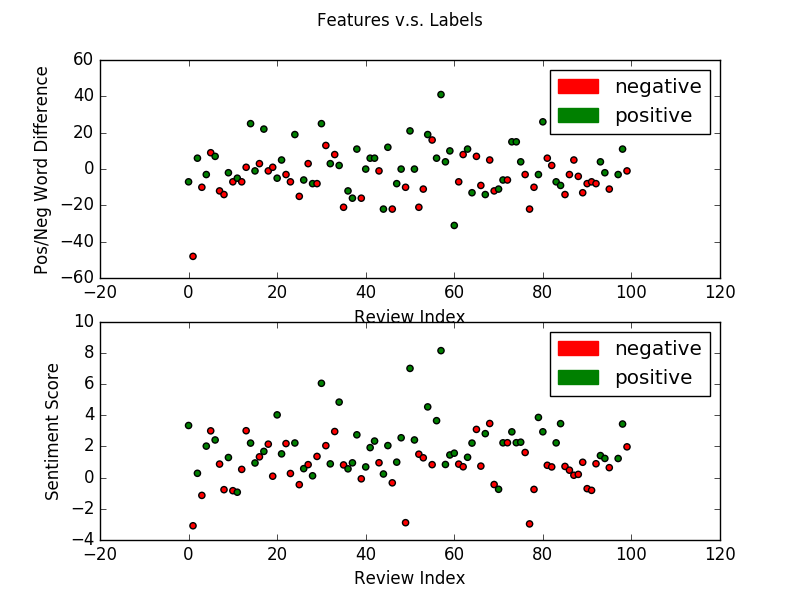

# Calculate Movie Review Sentiment from CS35 hw6 problem4

In this problem, I build a classifier for how positive and negative movie reviews are. 

1.The source texts(corpora) are from `movie_reviews` data set of `nltk` package. 

2.I use two features to build the classifier:
* difference between number of positive words and number of negative words
* sentiment score (an accumulated sum of polarity times subjectivity for each review) using `TextBolb` package

3.I also tried other features but didn't use them in final set of features:
* feature 1. number of words using TextBlob. But this feature helps least.
* feature 2. number of sentences using TextBlob. This feature helps, but not much.
* feature 3. accumulated subjectivity. This feature helps, but not much.
* feature 4. accumulated negative polarity. This feature helps most. 

4.Result analysis:
* Overall result: Final set of features gives scores ranging from 0.63-0.68 for both devtest set and test set. When seed = 1 in random(seed), score on devtest set is 0.65, on test set is also 0.65.
* Display of Errors: I write a function which displays errors to help improve the feature extraction function. The printed output is in the form of `review_name: guess(actual) features`. For example, `neg/cv118_28837.txt: pos (neg) [[-21.           1.50527214]]`.
* I also have a graphical summary of the two features and their relationship with the review sentiment. The graph consists of two scatterplots of the numerical results from two features. Negative label is indicated as a red point and positive label is indicated as a green point. 
* Please see the graph below and see the source code in the same folder

